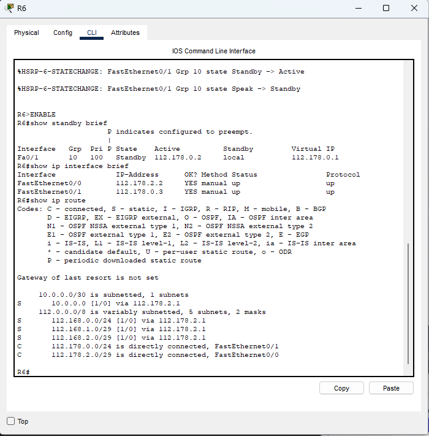

### Universidad de San Carlos de Guatemala
### Facultad de Ingeniería
### Escuela de Ciencias y Sistemas
### Redes de Computadoras 1
### Segundo Semestre 2024
---

|NOMBRE|CARNET|
|---|---|
|Erick Enrique González Chávez|201900621|

## Configuracion de IPs:

Carnet : 201900621

ultimo numero :1

### Router 1:
Se1/0
    
    10.0.0.1/30

Fa0/0

    112.168.1.2/29

Fa0/1

    112.168.2.2/29

### Router 2:
Fa0/0

    112.168.1.1/29

Fa0/1

    112.168.0.2/24

### Router 6:
Fa0/0

    112.178.2.2/29

Fa0/1

    112.178.0.3/24

### VCP 11
IP

    112.168.0.4/24

Mascara de subred

    255.255.255.0

Gateway

    112.168.0.1

### VCP 14
IP

    112.178.0.5/24

Mascara de subred

    255.255.255.0

Gateway

    112.178.0.1

### switch1

### switch3

## creación de Creación de ruta estática, creación de PortChannel con PAGP y LACP, creación de IP virtual con HSRP y configuración de VPC

### Configuracion R1
    enlable
    configure terminal
    no ip domain-lookup
    hostname R1
    int f0/0
    ip address 112.168.1.2 255.255.255.248
    no shutdown
    do write

    int f0/1
    ip address 112.168.2.2 255.255.255.248
    no shutdown
    do write

    int s1/0
    ip address 10.0.0.1 255.255.255.252
    no shutdown
    do write

    ip route 112.178.1.0 255.255.255.248 10.0.0.2
    ip route 112.178.2.0 255.255.255.248 10.0.0.2
    ip route 112.178.0.0 255.255.255.0 10.0.0.2
    ip route 10.0.0.0 255.255.255.252 10.0.0.2
    ip route 112.168.0.0 255.255.255.248 112.168.1.1
    ip route 112.168.0.0 255.255.255.0 112.168.2.1

### Configuracion R2
    enlable
    configure terminal
    no ip domain-lookup
    hostname R2
    int f0/0
    ip address 112.168.1.1 255.255.255.248
    no shutdown
    do write
    
    int f0/1
    ip address 112.168.0.2 255.255.255.0
    standby 10 ip 112.168.0.1
    standby 10 priority 150
    standby 10 preempt
    no shutdown
    do write

    ip route 112.178.1.0 255.255.255.248 112.168.1.2
    ip route 112.178.2.0 255.255.255.248 112.168.1.2
    ip route 112.178.0.0 255.255.255.0 112.168.1.2
    ip route 10.0.0.0 255.255.255.252 112.168.1.2

### Configuracion R3
    enlable
    configure terminal
    no ip domain-lookup
    hostname R3
    int f0/0
    ip address 112.168.2.1 255.255.255.248
    no shutdown
    do write

    int f0/1
    ip address 112.168.0.3 255.255.255.0
    standby 10 ip 112.168.0.1
    no shutdown
    do write

    ip route 112.178.1.0 255.255.255.248 112.168.2.2
    ip route 112.178.2.0 255.255.255.248 112.168.2.2
    ip route 112.178.0.0 255.255.255.0 112.168.2.2
    ip route 10.0.0.0 255.255.255.252 112.168.2.2

### Configuracion R5
    enable
    configure terminal
    no ip domain-lookup
    hostname R5
    int f0/0
    ip address 112.178.1.2 255.255.255.248
    no shutdown
    do write

    int f0/1
    ip address 112.178.0.2 255.255.255.0
    standby 10 ip 112.178.0.1
    standby 10 priority 150
    standby 10 preempt
    no shutdown
    do write
    
    ip route 112.168.1.0 255.255.255.248 112.178.1.1
    ip route 112.168.2.0 255.255.255.248 112.178.1.1
    ip route 112.168.0.0 255.255.255.0 112.178.1.1
    ip route 10.0.0.0 255.255.255.252 112.178.1.1
    
### Configuracion R6
    enable
    configure terminal
    no ip domain-lookup
    hostname R6
    int f0/0
    ip address 112.178.2.2 255.255.255.248
    no shutdown
    do write

    int f0/1
    ip address 112.178.0.3 255.255.255.0
    standby 10 ip 112.178.0.1
    no shutdown
    do write
    
    ip route 112.168.1.0 255.255.255.248 112.178.2.1
    ip route 112.168.2.0 255.255.255.248 112.178.2.1
    ip route 112.168.0.0 255.255.255.0 112.178.2.1
    ip route 10.0.0.0 255.255.255.252 112.178.2.1

### Configuracion R4
    enlable
    configure terminal
    no ip domain-lookup
    hostname R4
    int f0/0
    ip address 112.178.1.1 255.255.255.248
    no shutdown
    do write

    int f0/1
    ip address 112.178.2.1 255.255.255.248
    no shutdown
    do write

    int s1/0
    ip address 10.0.0.2 255.255.255.252
    no shutdown
    do write

    ip route 112.168.1.0 255.255.255.248 10.0.0.1
    ip route 112.168.2.0 255.255.255.248 10.0.0.1
    ip route 112.168.0.0 255.255.255.0 10.0.0.1
    ip route 10.0.0.0 255.255.255.252 10.0.0.1 
    ip route 112.178.0.0 255.255.255.0 112.178.1.2

### Configuracion switch0:
    enlable
    configure terminal
    no ip domain-lookup
    int range fa0/23-24
    channel-protocol pagp
    channel-group 1 mode ?
    channel-group 1 mode auto
    do write
    end

### Configuracion switch1:
    enlable
    configure terminal
    no ip domain-lookup
    int range fa0/23-24
    channel-protocol pagp
    channel-group 1 mode ?
    channel-group 1 mode desirable
    do write
    end

### Configuracion switch2:
    enlable
    configure terminal
    no ip domain-lookup
    int range fa0/23-24
    channel-protocol lacp
    channel-group 1 mode ?
    channel-group 1 mode active
    do write
    end

### Configuracion switch2:
    enlable
    configure terminal
    no ip domain-lookup
    int range fa0/23-24
    channel-protocol lacp
    channel-group 1 mode ?
    channel-group 1 mode active
    do write
    end

### Configuracion de VPC11

### Configuracion de VPC12

### Configuracion de VPC13

### Configuracion de VPC14

## Comandos Empleados para verificacion del correcto funcionamiento de los protocolos
    show etherchannel summary
    show running
    show standby
    show standby brief
    show ip interface brief
    show ip route
    ping